# Hi 👋, I'm 杨墨

A beginner on a journey to learn programming.

<picture>
  <source media="(prefers-color-scheme: dark)" srcset="https://raw.githubusercontent.com/yangmoooo/yangmoooo/output/github-snake-dark.svg">
  <source media="(prefers-color-scheme: light)" srcset="https://raw.githubusercontent.com/yangmoooo/yangmoooo/output/github-snake.svg">
  
</picture>
